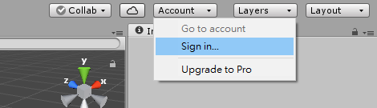
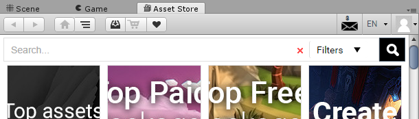
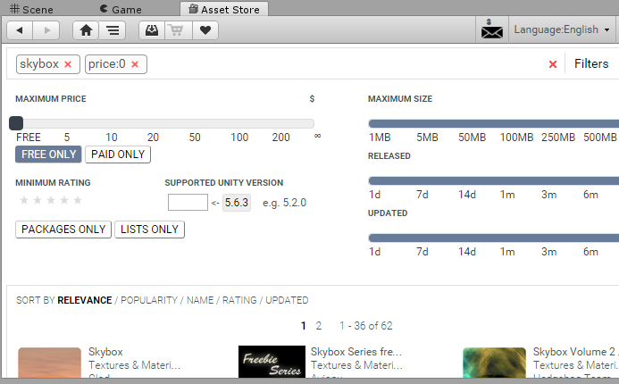
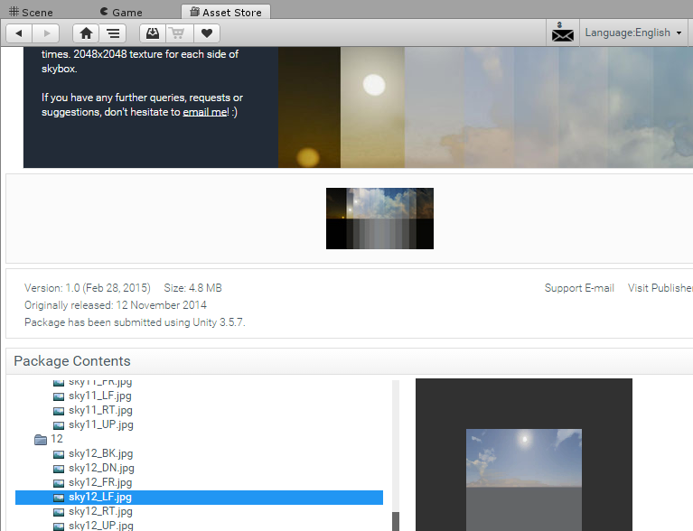
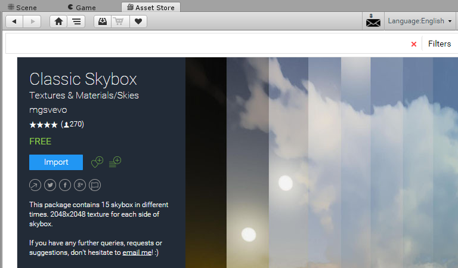
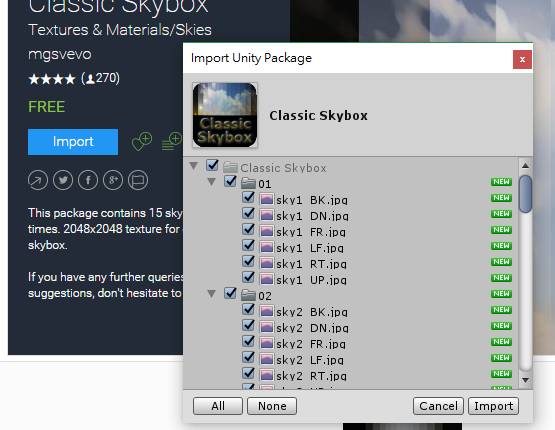
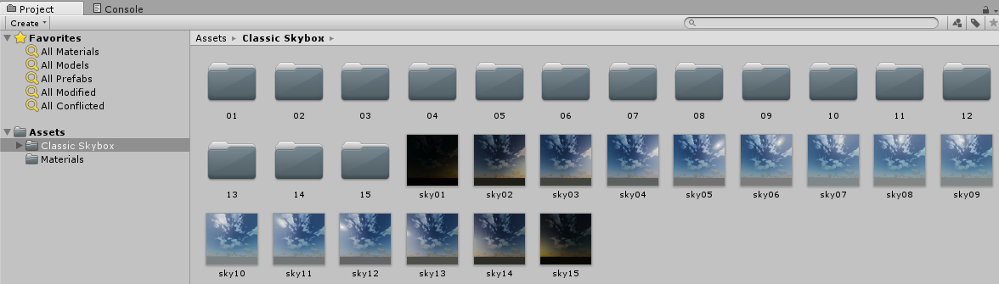
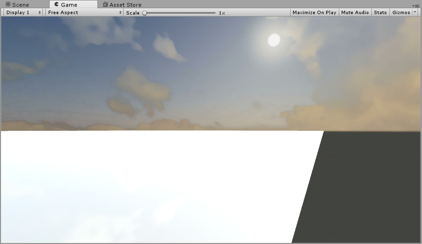

# Asset Store

The resource is the component collection to establish the scene, including terrain, 3D object, texture, prefab, etc. To make a specific resource is always an important step. In unity, it provides designers with a asset store collecting any types of resources. The following is the step demostrating how to use the asset downloaded from the store.

* Sign in the account.

* Surf the `Asset Store`.

* Type the resource what you want to search, for example, skybox. After clicking search button, it is easy to execute an advanced searching by constraining some conditions, for example, price for free.

* Choose an ideal asset package and you can quickly view the content, for example the texture, in `Package Contents`.

* If you decided the asset package, you can press the `Import` to download and import it into the package automatically.

* You can select what resources to import, or import all ones by default.

* After the resource is imported, it would appear on the asset view.

* How to use the imported resource would depend on the action you taken, for example, drag the one type of the sky into the scene and you will see the sky changed.

