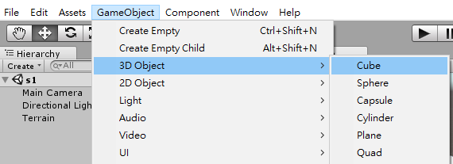
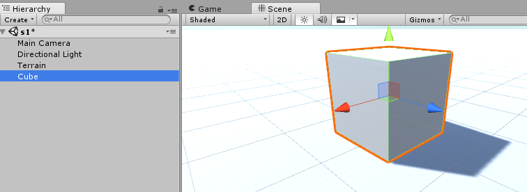
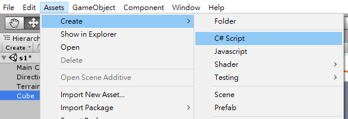
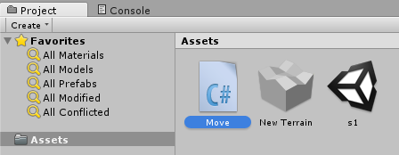
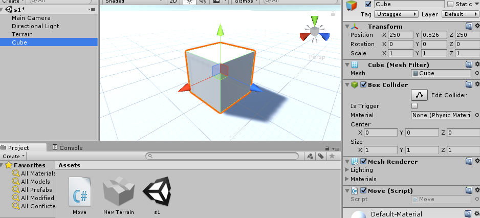
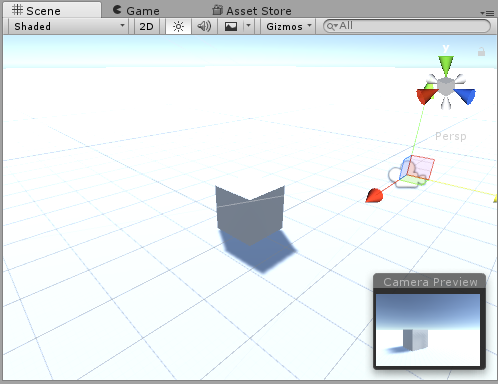
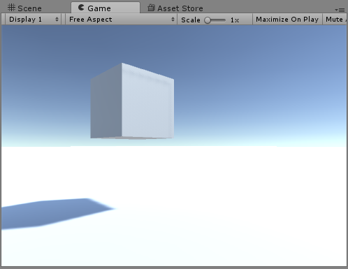
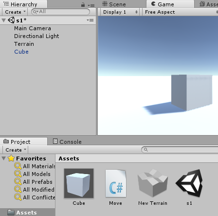
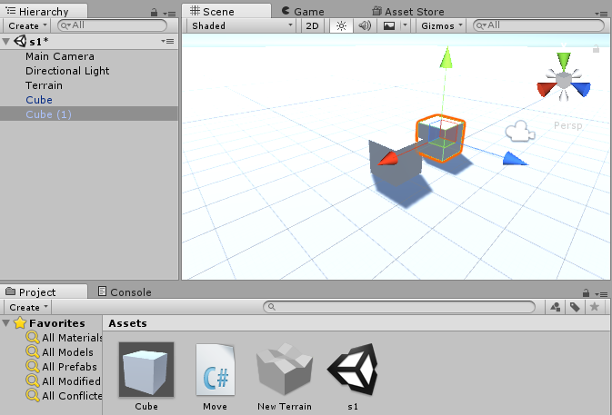
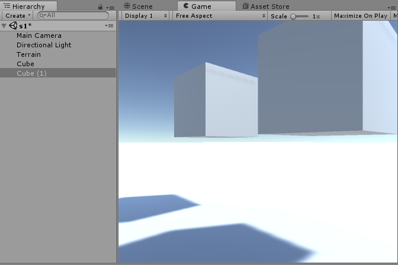

# GameObject / Prefab


GameObject is the object on the scene. You can easily create a `GameObject` by clicking `GameObject` on the toolbar, and choose the item (for example, light, terrain, etc.) what you want to create.


Prefab (Prefabricated) is a `Prefabricated GameObject` and a type of resources and is used in repeated objects, e.g. enemy, weapon, car, etc. You can create a origin object and transform it into a prefab resource. if it is needed to repeatedly generate objects, you can add the copy of prefab, called a `instance`, into the game scene. You can also add the same prefab into different projects. (The prefab is similar with class-object relation in the object-oriented programming.) The instance is related with the prefab. If the prefab is changed, the whole instances are also changed. That is the useful feature if you create lots of instances and you need to modify all of them.


The following is the demo for generating a prefab from a gameobject.


* Create a 3D object.




* A created object is the `GameObject` on scene.




* Create a script to make the cube move.




* The script is named as `Move`.




* Edit the script to make the cube move by double click the script. (If you have installed visual studio, it would open it to edit the script.) Edit the following content to make cube keep moving. **Notice the class name is the same with the file name.**

```c#
using System.Collections;
using System.Collections.Generic;
using UnityEngine;

public class Move : MonoBehaviour {

	// Use this for initialization
	void Start () {
		
	}
	
	// Update is called once per frame
	void Update () {
        Vector3 v3 = this.transform.position;
        v3.y += 0.05f;
        this.transform.position = v3;
	}
}
```


* Link the script to the cube by draging it to the `Inspector` of the cube (or to the cube on `Hierarchy` view). The script would exist on the bottom of inspector of the cube.




* Adjust the camera to make the cube in sight.




* Press `PLAY` and you will see the cube keep moving.




* Create a cube prefab is easily to drag the cube into the `Asset` view.



 Alternatively, you can create a empty prefab by clicking `Assets`, `Create`, `Prefab` on the toolbar. Second, drag the cube to the empty prefab. 


* You can now drag the prefab cube (on `Assets`) into the `Hierarchy` view, and then drag it into the scene. You will see there are two identical cubes on the scene. (You might see only one due to overlapping. You will see both of them by moving one of them to another location.)




* Press `PLAY` and you will see both of them are moving.




Generally speaking, a prefab is generated from a gameobject and can be reproduced many times.