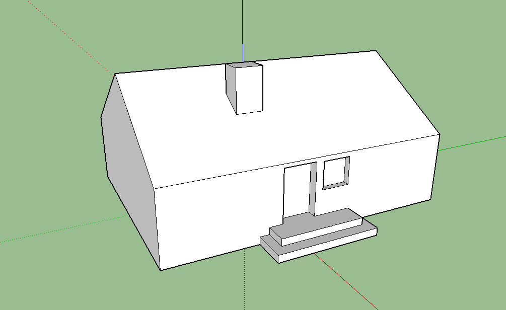
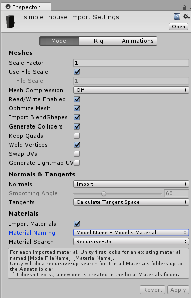
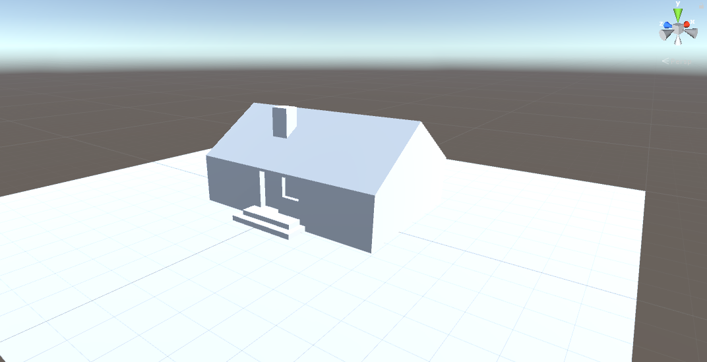

# Import 3D Modeling Objects

Unity is further a integrated creation platform. While creating objects or scenes in the game or in reality design, it supports to import them from others desgin tools like `autocad`, `sketchup`, `maya`, etc. It mainly supports the following file format: `.FBX`, `.dae`, `.3DS`, `.dxf` and `.obj` files. If tools you used support to export the above format, it would be imported into unity. In the document, we demostrate several format imported into unity.

## AutoCAD

## Sketchup

* You have already done a 3D modeling in Sketchup.

* In sketchup, click `file`, `export`, `3D modeling`, and save as a `.dae` file.
* In unity, click `Assets`, `Import New Asset`, and choose the `.dae` file exported from sketchup. And you will see the object in the `Project View` and its sub view `Assets`.
* In unity, click the imported object and set the following attributes in `Inspector`. Click `Generate Colliders`, click `Import Materials`, choose `Model Name + Model's Material` on the `Material Naming` and click `Apply`.

* Drag the object in `Assets` to the scene.

## Maya

