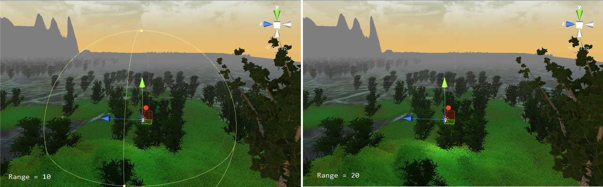
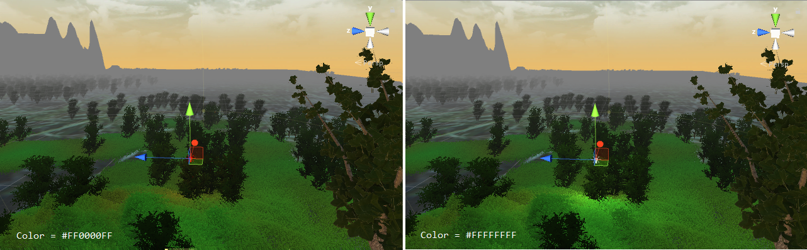
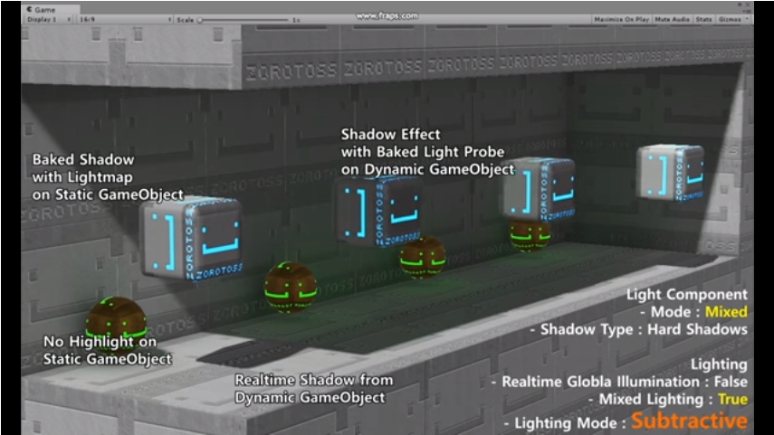
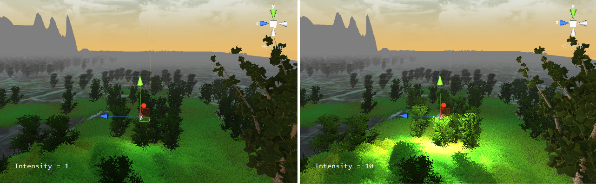
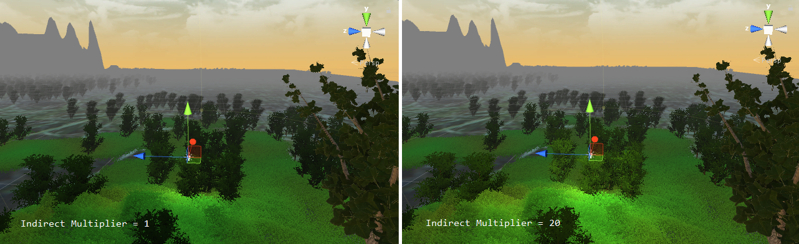
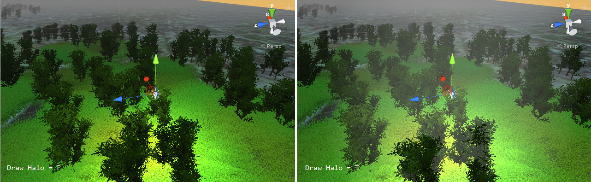
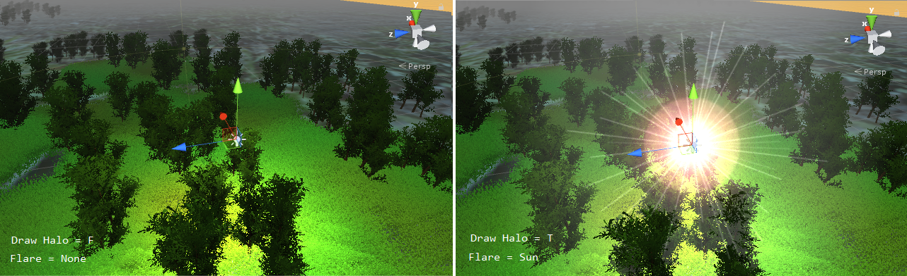
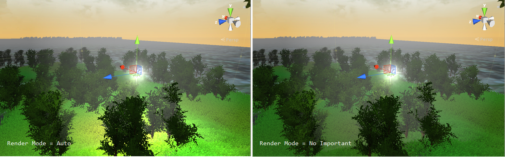

# Light

The light is a key component in Unity to provides users with realistic lighting environment. In Unity, it provides with different types of light source to be used in different environments, including `point light`, `spotlight`, `area light`, and `directional light`. The scene would be dark if there is no light.

In Unity, it is easy to add a light component by clicking `GameObject`, `Light`, and choose the desired light type. You can change the light attributes on the `Inspector` view.

## Point Light

A light that gets emitted from a single point in all directions. You can change the location of the point light to get the desired lighting effects. The point light is common source inside the house, such as the candle. 

You can also change the `Light` attributes on the `Inspector` view.

* `Type` : It is the type of the light source, including `Point`, `Spot`, `Directional`, and `Area`. You can directly transform it into another type of the light source.
* `Range` : Set the range of the emitted light. Only both types of `Spot` and `Point` light can change the lighting range.

* `Color` : Set the lighting color.

* `Mode` : Set the lighting mode, including `Realtime`, `Mixed`, and `Baked`. Different lighting mode cause different lighting result on the area. The `Realtime` mode would reflect the directly lighting result at the run time, the `Baked` mode would precompute the lighting result, and the `Mixed` mode would combine the above both. The following is the youtube vedio demostrated by `Hj Zo`. It is a very good demostration among lighting mode changes.

[Unity 5.6 Light Mode Comparison](https://www.youtube.com/watch?v=sQPa8sLtICs)

* `Intensity` : Set the strength of the light source.

* `Indirect Multiplier` : Set the value to vary the intensity of **indirect light**. The `Indirect Multiplier` defines the brightness of bounced light calculated by the global illumination (GI) system.

* `Shadow Type` : Set the object's shadow type generated by the light source. There are three types, `No Shadows`, `Soft Shadows`, and `Hard Shadows`. The `Hard Shadows` produces shadows with a sharp edge, and it is looked more realistic than `Soft Shadows`.
* `Draw Halo` : It is the switch for drawing the halo of the point light.

* `Flare` : Set the flare of the light source.

* `Render Mode` : Set the mode for rendering lighting to the scene. If it is set to `No Important`, there is no emitted light to the scene.

## Spotlight

## Directional Light

## Light Mapping

## Light Plugin

