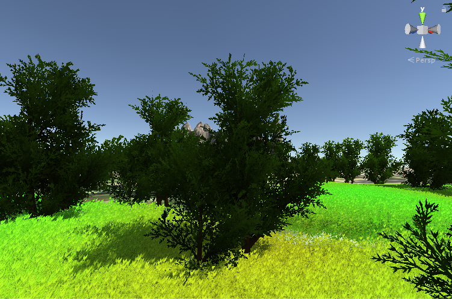
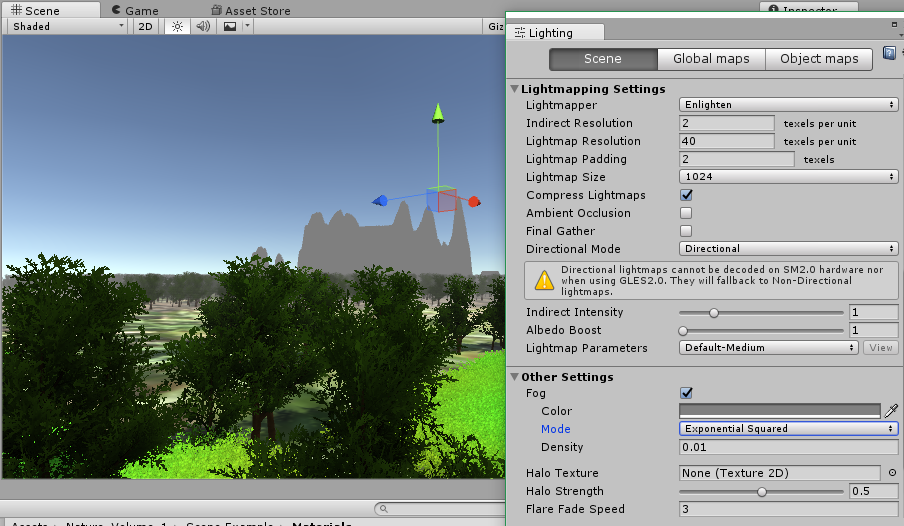
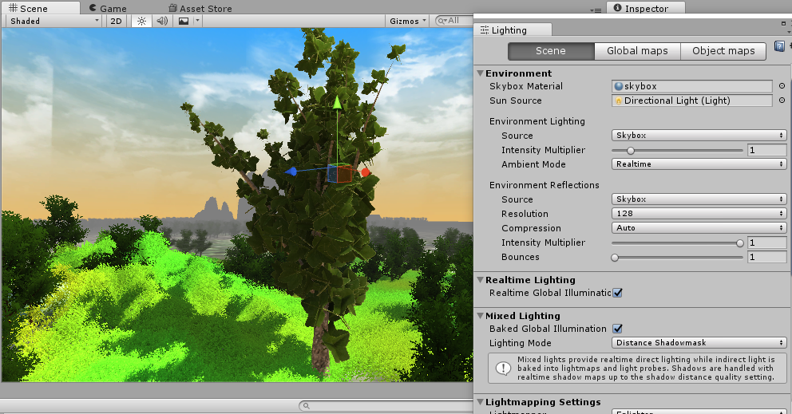

# Sky Environment

In Unity, the default sky is the gradient blue color. You can change it though changing the gradient color or texturizing it.

## Rendering Sky

* Click `Window`, `Lighting`, `Settings` on the toolbar to set the parameter for rendering the sky.

* On `Lightmapping Settings`, you can also set the `Ambient Occlusion` to reinforce the details of the lighted object.

* On `Other Settings`, you can set the `Fog` switch and edit its parameters.

  * `Color` : Set the fog color, and its default is gray.
  * `Mode` : Set the fog spreading mode, including LInear, Exponential, and Exponential Squared.
  * `Density` : Set the fog concentration ranging from 0 (minimum) to 1 (maximum). In general, you can increase or decrease it by 0.01 unit.

  

* On `Other Settings`, you can also set `Halo Texture`, `Halo Strength`, `Flare Strength`, `Flare Fade Speed`, and `Spot Cookie`.

* On `Environment`,

  * [Option] You can download the asset package from the asset store, for exmple, `Classic Skybox`, etc.
  * `Skybox Material` : You can change the sky texture, for example, skybox, etc. The texture consists of six different texture images.
  * `Sun Source` : Set the light source represents the sun source. In general, usually set the `Directional Light` as the sun source.

## Resource

* You can also download the dynamic skybox which is based on different time peroids during the day.

