# Terrain Generator

It is necessary to create a terrain to a game. In Unity, it is easy to create a terrain by the built-in editor. It is recommended to import a terrain asset package if there is no texture for the terrain.

## Create a Terrain

* You can create a terrain by clicking `GameObject`, `3D object` and `Terrain` on the toolbar.
* You can change the attributes of the terrain, e.g. width, height, etc., on the `inspector` view.

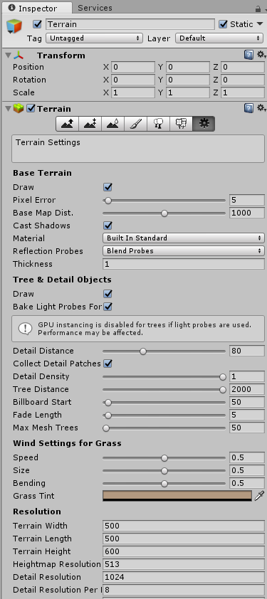

* There are 7 basic options to edit the terrain.

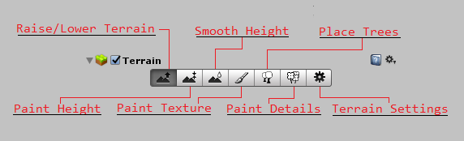

## Raise / Lower Terrain

* Choose the option `Raise / Lower Terrain`, select the one brush, and start to draw on the terrain (raise the terrain). 
* If you draw with Shift key, it would lower the terrain.

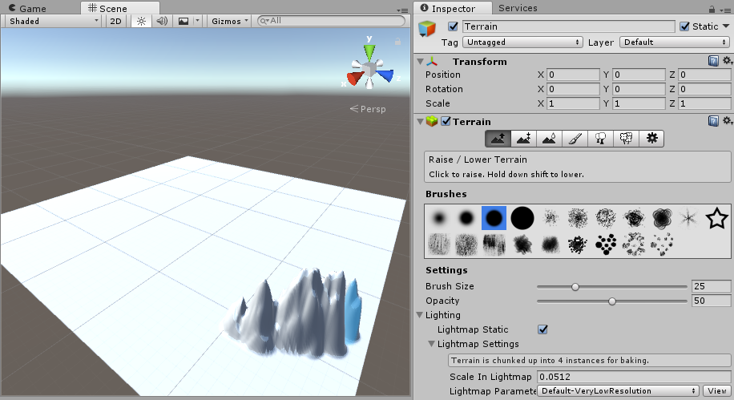

## Paint Height

* Choose the option `Paint Height`, select the one brush, and start to draw on the terrain. 
* The difference between `Raise / Lower Terrain` and `Paint Height` is the second one would limit the raising height. You can set the height limitation on the `Settings`.

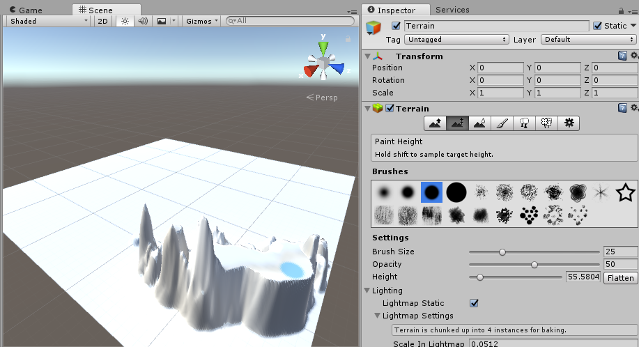

## Smooth Height

* Choose the option `Smooth Height`, select the one brush, and start to draw on the terrain. It would smooth the convex of the terrain.

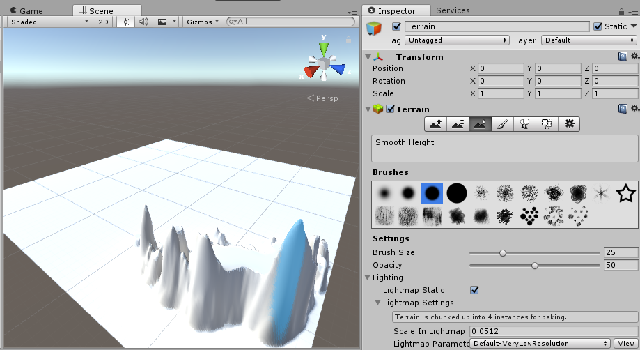

## Paint Texture

* [Optional] Download and import the terrain asset package if there is no texture for terrain. (Here, we use `Nature Volumn 1` as the example.)
* Choose the option `Paint Texture`.
* Add the texture on `Textures` by clicking `Edit Textures`, select a type of textures with its normal type, and click `Add`.

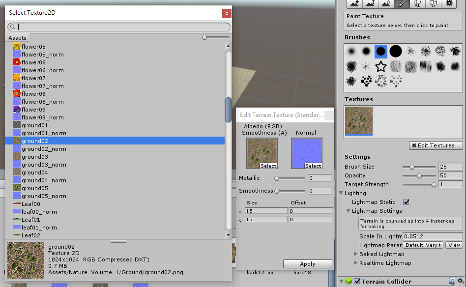

* You can view the textured terrain. It looks like to paste a image on the terrain repeatedly. You could simply change the tile size (x = 15 and y = 15 by default) to scale the image size to be pasted to the terrain.

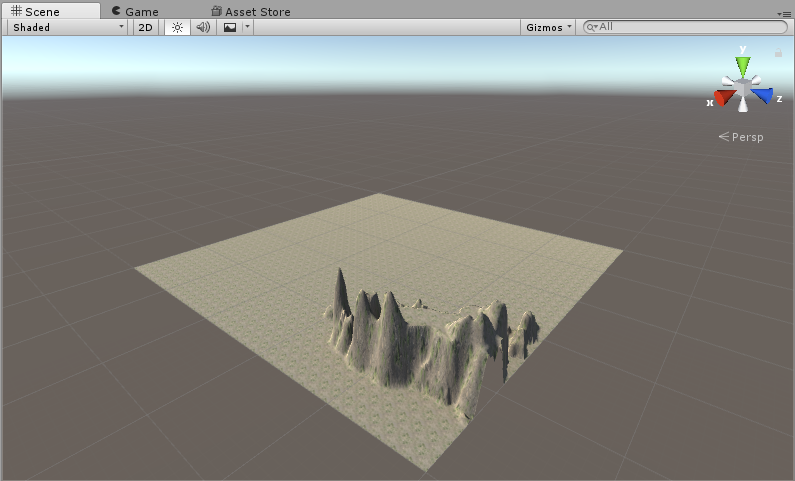

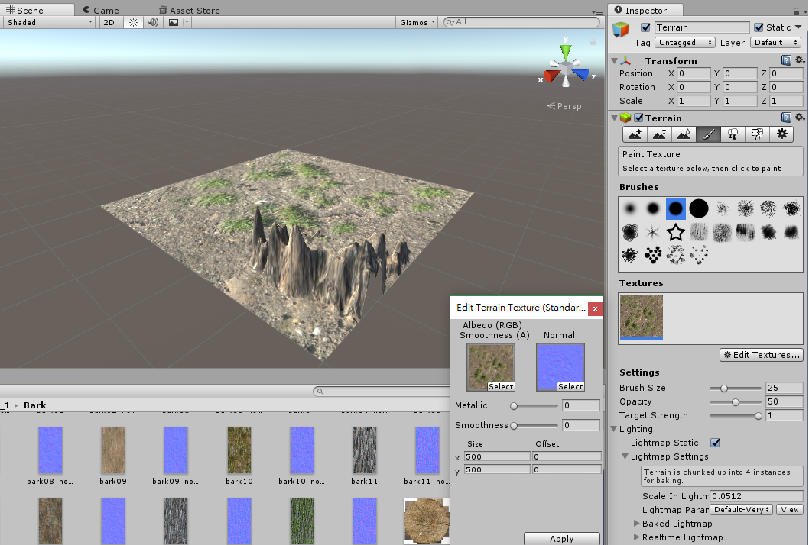

## Place Trees

* [Optional] Download and import the tree asset package (Here, we use `Nature Starter Kit 2` as the example.)
* Choose the option `Place Trees`, and preapre a tree by clicking `Edit Trees`, `Add Tree`, `Tree Prefab`. 

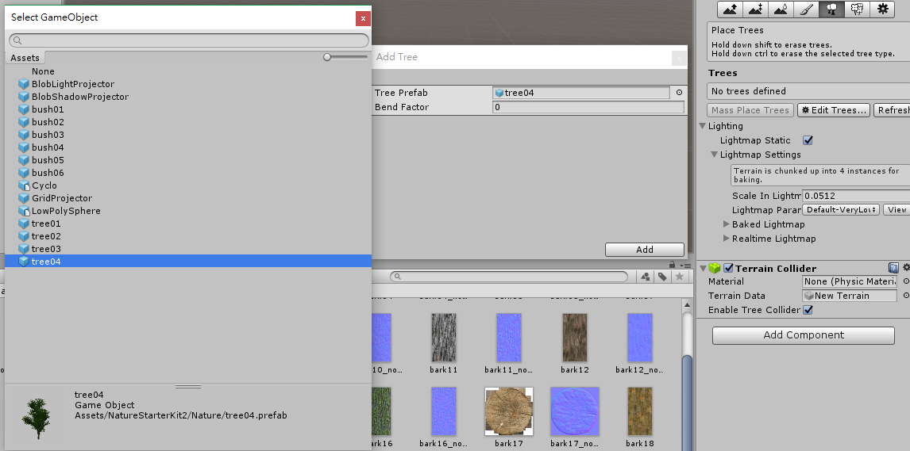

* Drag the tree prefab from `Inspector` view into the scene. You can also add trees to where you want to place by clicking.

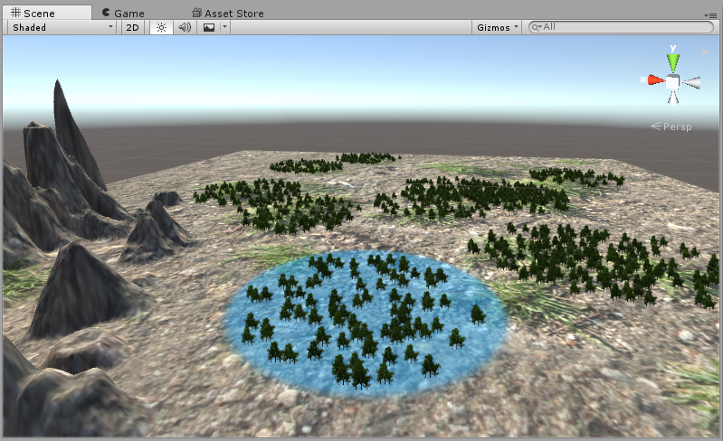

## Paint Details

* [Optional] Download and import the asset package (Here, we use `Nature Starter Kit 2` as the example.)

* You can also add others details into the scene, for example, bushes, rocks, etc.
* The procedure to import the asset package is similar with the previous `Place Trees`. Choose `Paint Details`, click `Edit Details`, and `Add Grass Texture` or `Add Detail Mesh`.

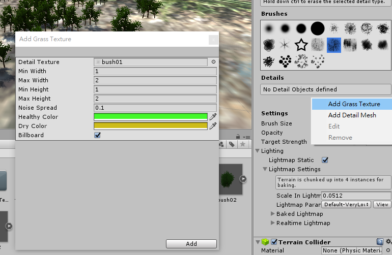

* Choose the desired brush, and draw it on the desired place.

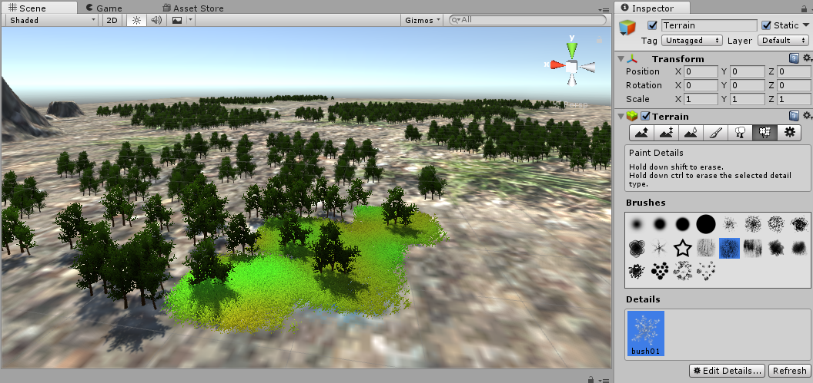

## Terrain Settings

* Choose `Terrain Settings`, there are several basic environment configurations.

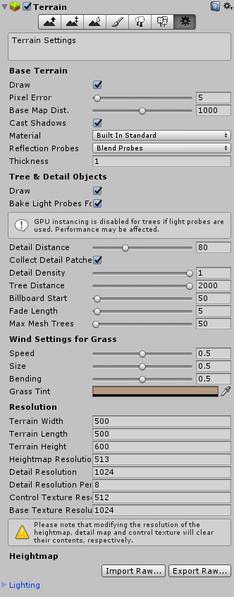

* Base Terrain
  * `Pixel Error` : The error for showing the 3D object on the view. It represents LOD (Level of Development / Level of Detail). While the value is more higher, the object pixel is shown in more detailed.
  * `Base Map Dist` : The distance is set for higher resolution zone.
  * `Cast Shadows` : It is the flag for controling the shadow from the light projection.
* Wind Settings
  * `Speed` : wind speed
  * `Size` : the area affetced by the wind
  * `Bending` : the angle changed by the wind
  * `Grass Tint` : the color tint setting for the grass and the grid
* Resolution : the configuration for width, length, height of the terrain and it related resolutions