# Tree Generator

In Unity, it also supports to generate a tree model though a built-in creator. 

## Create a Tree

* It is easy to create a tree by clicking `GameObject`, `3D Object`, `Tree` on the toolbar. The tree only consists of the tree root node and the branch group after it is created. You can add nodes and leaves after that. The `Inspector` view shows the current tree component.

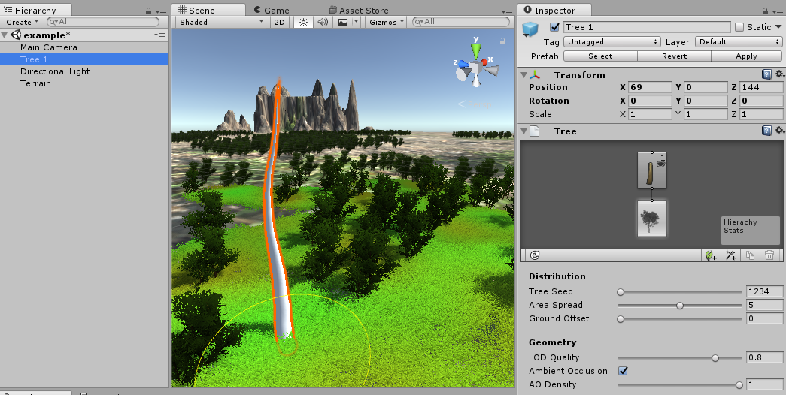

* You can see the structure of the tree after you click the `Branch Group`. You can also change the tree structure by moving, rotating, scaling the node. There is the icon like an eye on the trunk that is the switch for showing or hiding the it.

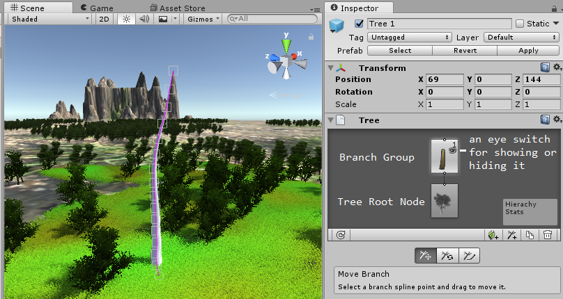

* [PS] In Unity, it also supports the mode for automatically generating the tree. You can only choose one of both, manual editing or automatic generating it. You can switch to the automatic generating mode by clicking `Convert to procedural group`.

## Add Branch Group

* Click the `Add Branch Group` to add side branches. You can change the tree structure on the setting Distribution.

  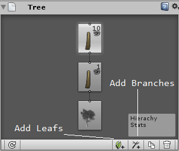

  * `Group Seed` : Set for the generating seed of side branches.

    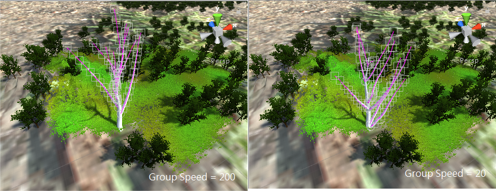

  * `Frequency` : Set the amount of the total side branches.

    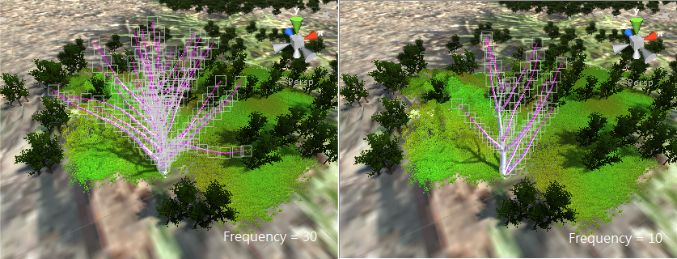

  * `Distribution` : Set the direction for generating side branches, including `Random`, `Alternate`, `Opposite`, `Whorled`, etc.

    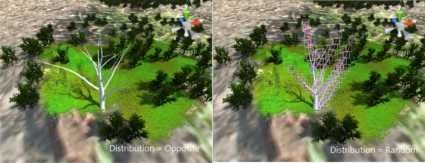

  * `Growth Scale` : Set the length for generating side branches.

    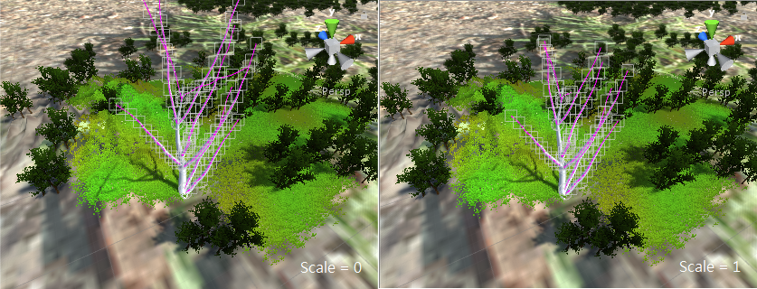

  * `Growth Angle` : Set the angle for generating side branches.

    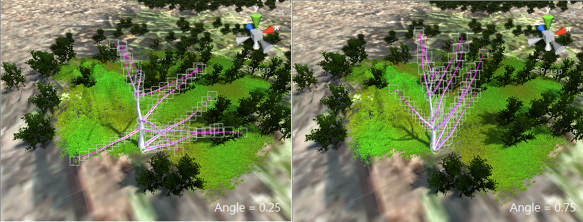

## Add Leaf Group

You can add leaves to the created tree by clicking `Add Leaf Group`. You would see the blank plane for the leaf texture. 

* The `Distribution` settings for leaves is similar with the branches' ones, including `Group Seed`. 
  * `Frequency` : For example, you can add leaves by increasing the frequency.

* The difference from the Branch Group is that the leaf setting provides `Geometry Mode`, including `Plane`, `Cross`, `Tricross`, `Billboard`, and `Mesh`.

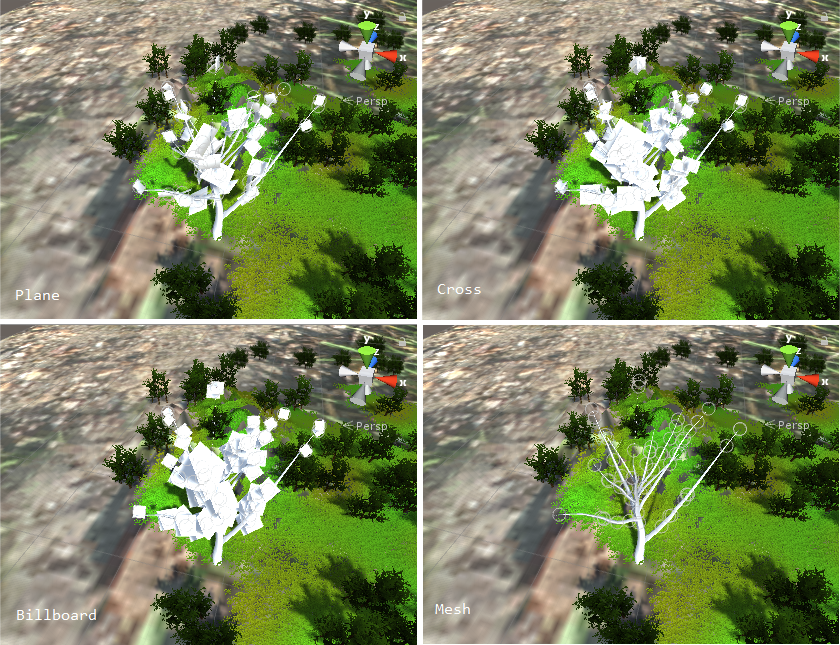

* You can copy the same branch group or the same leaf group by clicking `Duplicate Selected Group`.

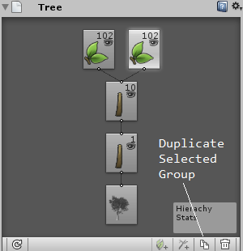

## Branch Texture 

* After creating branches and leaves, it is necessary to texture them. Click the branch group, and set the texture on `Branch Material`, for example, bark.

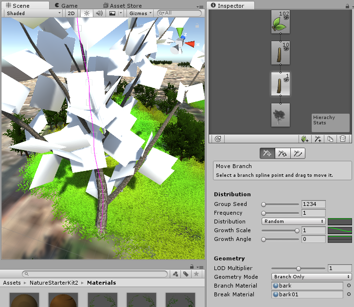

## Leaf Texture

* Click the leaf group, and set the texture on `Material`, for example, Leaf.

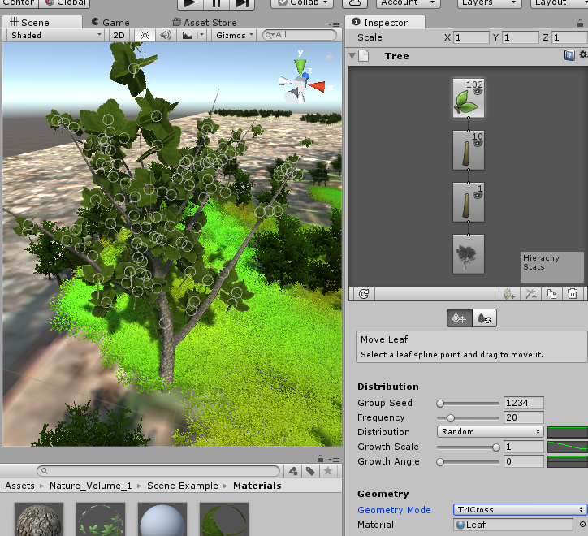

## Create a Wind Zone

* In Unity, it also supports the wind mode that decides swaying of leaves in the wind. Click the leaf group, and set parameters for the wind zone.
  * `Main Wind` : the strength of the wind
  * `Main Turbulence`, `Edge Turbulence` : the strength of the wind turbulence

* You can `Play` the game, and see how leaves sway.

## Create a Collider

The created tree is also a 3D object on the scene. The tree is a obstacle while other objects attempt to pass through it. In Unity, you can create a `Collider` to achieve such ideas. In general, the tree object usually uses a capsule type of colliders.

* It is easy to add a collider for the tree by clicking `Add Component`, `Physics`, `Capsule Collider`.

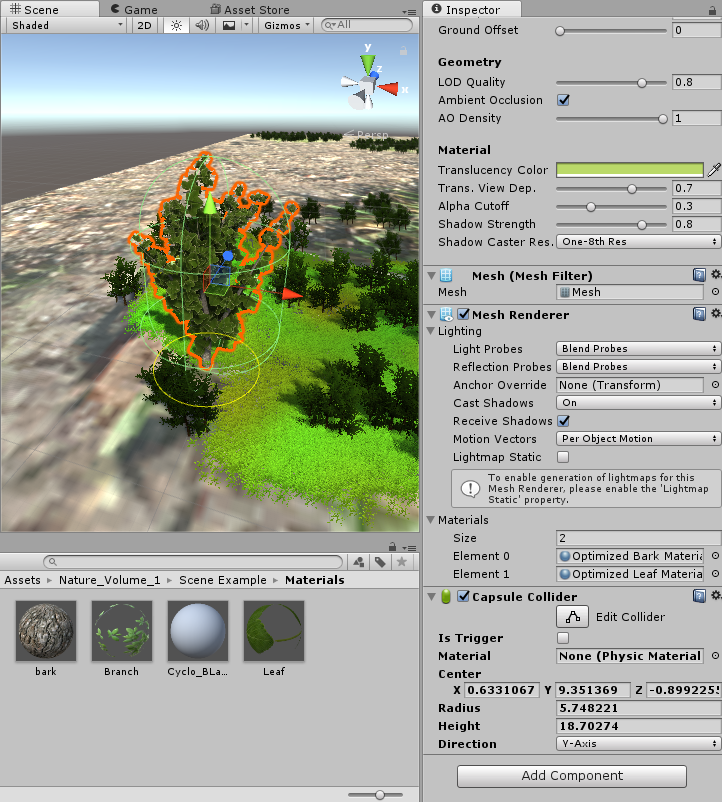

* It is important to notice the collider you have added to the target(to the GameObject or to the prefab). 
  * If you add a collider to the `GameObject`, the collider only works on the GameObject, and it shows on the `Hierarchy` view. 
  * On the contrast, if you add a collider to the `Prefab`, the collider works on the whole instance, and it shows on the `Project` view.

## Remove a Collider

* You can also remove the collider by right-click the component and choose the `Remove Component`.

