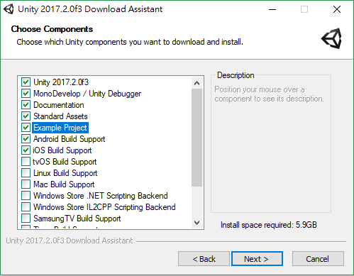
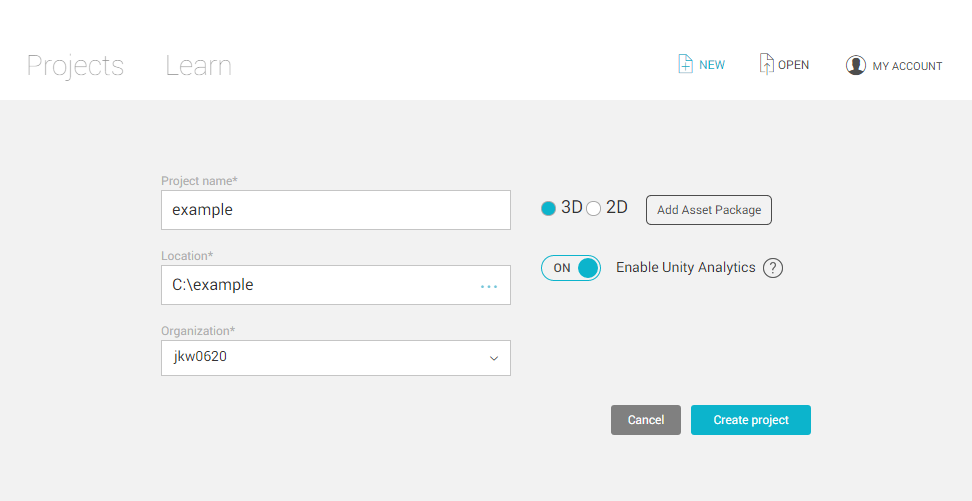
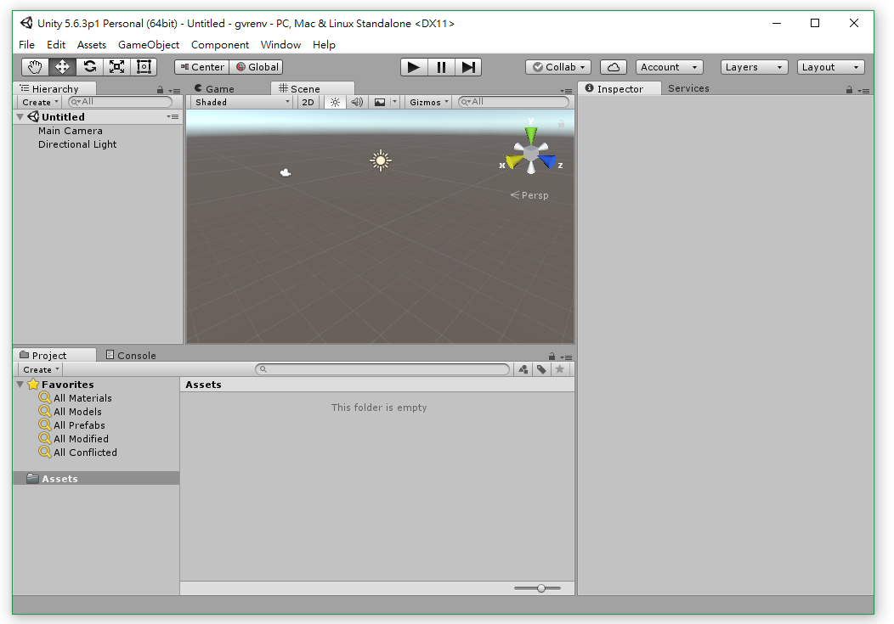
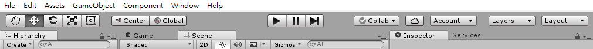
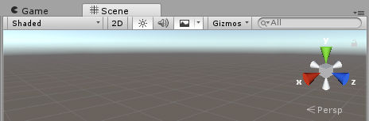
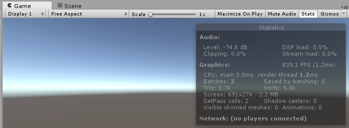

# User Interface

Unity provides users a friendly user interface, starting from the installation, designing the work to exporting the it.

## Installation

The following are installation steps specific to the version `Unity 2017.2.0f3`, not old version `5.6.3`. The installation step is similar with others tools (keep clicking `Next`). 

* The important change in the new installation version is that it provides component selection. It is easy to select several developing environment to install at the beginning. Recommanded components are `Unity 2017.2.0f3` (main), `MonoDevelop / Unity Debugger`, `Documentation`, `Standard Assets`, `Example Project`, `Android Build Support`, `iOS Build Support`, `Linux Build Support`, `Mac Build Support` and `Vuforia Build Support`. (The old version installation does not provide such component selection to install. It requires others `support-for-editor` plugins.)

* Recommand to `create a account` and sign in the unity. 

* Unity provides users with two activation  modes, `Unity (Plus or Pro)` and `Unity Personal`. The `Plus or Pro` version requires a commercial license but to provides you more tools. The `Personal` version don't need license but to limit some tools, and is free to use. (In the document, the personal version is enough for the instruction.)

## Create a New Project

It is easy to create a new project while clicking `Unity` and click the `New` button on the top of unity. Type information to the textbox `Project name`, select the project path on `Location`, choose a organization on `Organization`, and click `Create project`.

## Operations

* The working window in Unity consists of several views with different features, and users can adjust the size or relative locations of them.

* `ToolBar` is on the top of the window, provides users `Moving`, `Rotation` and `Scaling` objects.
  * `Transform Tools` : `Drag`, `Move by 3 axis`, `Rotate by 3 axis`, `Scale by 3 axis`
  * `Transform Gizmo Toggle` : switch objects into `self` or `global` coordinates
  * `Play Tools` : `Play`, `Stop` and `Resume` of the game view

* `Scene View` is the main operation zone. You can edit the terrain or import others 3D objects, including light, camera, or particle system, etc.
  * change `Persp` (perspective) or `Iso` (isometric) mode
  * click `2D` to switch 2D or 3D view

* `Game View` is used to test the execution. While playing the game, the game view of the player is presented by the camera, and the sound source is from the microphone of the camera, so there is at least one camera on the scene. If there is no camera, the view would be empty (dark). By default, there is one camera when you create a new project.
  * click `Stats` to show the several resource information about the execution.

* `Hierarchy View` shows objects in the scene and their relative hierarchies. When you need additional objects or scripts to be added into the scene, the simple step is to drag it into the hierarchy view. By default, the object in blue text is pre-made, and the one in gray text is temp closed.

* `Project View` : Unity conserves all objects of the project into the same directory. You can retrieve all of them on the project view. You can establish the `Scenes`, pre-make the `Prefabs`, edit the `Scripts`, import the `3D Models`, import the `Textures`, or import the `Audio` and manage all of them on the project view. If there are others resources that you want to import, they can be imported by `Assets`, `Import New Asset` and choose them.

* `Inspect View` is on the right of the window, and it is used to set the attribute of the object, including name, coordinates, rotation angle, and scaling ratio, etc. On the other hand, it is also used to set parameters for those affecting the object attributes such like lighting, camera, collision, scripts, etc.

* `Layout` is used to change the view arrangement, including `2by3`,  `4Split`, `Tall`, `Wide`, etc. You can rearrange the whole views and save it as the self-customized layout.

* [optional] `Skin` (on `Edit`, `Preferences`, `General`, `Editor Skin`) is used to change the color of the operation window. It can change to Light (default in person version) / Dark (default in plus / pro version).

