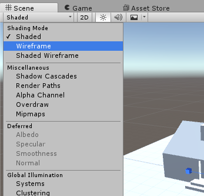
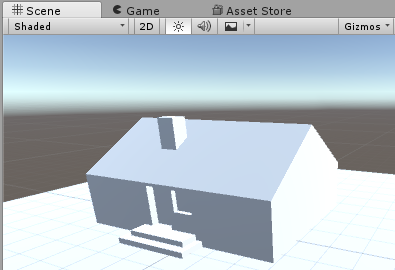
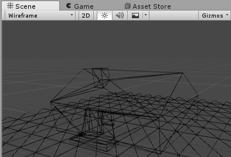
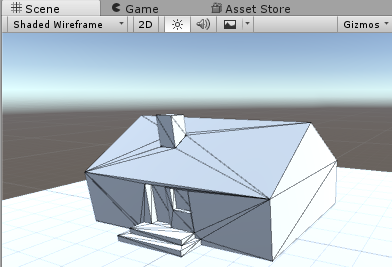
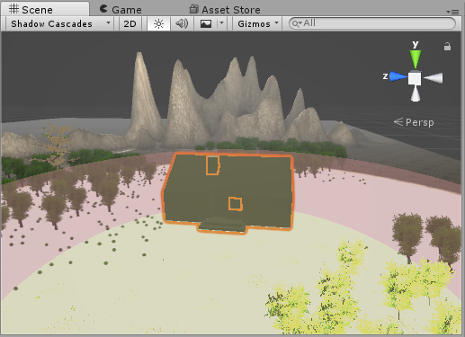
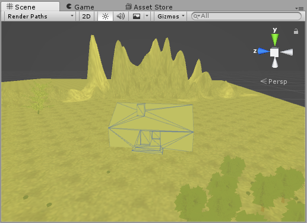
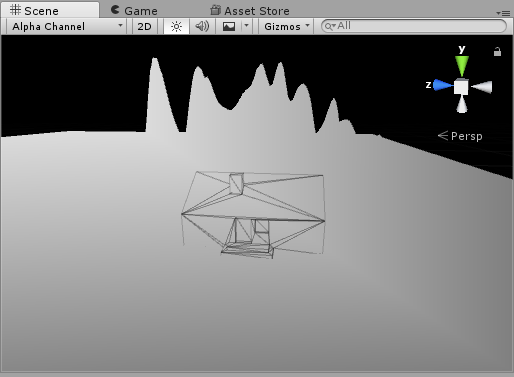
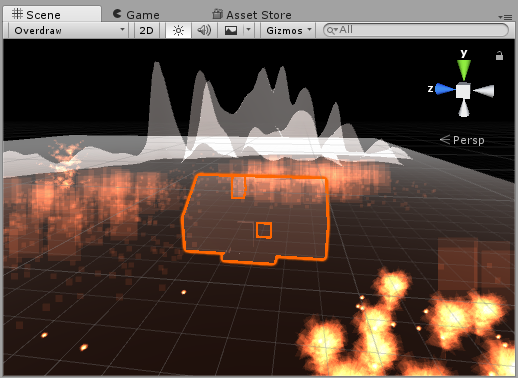
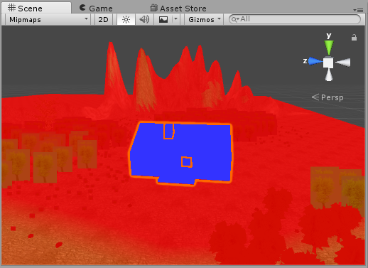
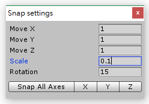

# View / Object Control

## Scene View Mode

Different view modes make designer edit the object more specifically. It is simply to switch among them by clicking the `Shading Mode`.

* `Shaded` mode : It is the most similar with the real game view.

* `Wireframe` mode : It only shows the wire of the whole object, and is uesed to check the wire distribution.

* `Shaded Wireframe` mode : It combines the above two modes.

You can also switch different rendering modes.

* `Shadow Cascades` mode : Rendering the object by light sources.

* `Render Paths` mode 

* `Alpha Channel` mode : It is useful to the color combination.

* `Overdraw` mode (Semi-transparent)

* `Mipmaps` mode :  It is also called MIP map. It is used to speed up the rendering and decrease image jaggies by pre-calaulating textures, etc.

## View Control

* `Alt + left-click` (mouse) : View Rotation 

* `Alt + middle-click` (mouse) : View Panning

* `Alt + right-click` (mouse) : View Zoom-in / Zoom-out

* `right-click + WSAD (keyboard)` : move as the first person perspective

## Object Control

* view the object on the center of the window : Select the target object and press `F` key, or double click it on the Hierarchy view. You can change the hot key on `Edit`, `Preferences`, `Keys` on the toolbar.

* The following is the standard editing unit. You can change each items on  `Edit`, `Snap Settings` on the toolbar.

  * `Ctrl + move the object` : move the object by 1 unit

  * `Ctrl + rotate the object` : rotate the object by 45 degree
  * `Ctrl + scale the object` : scale the object by 10%

